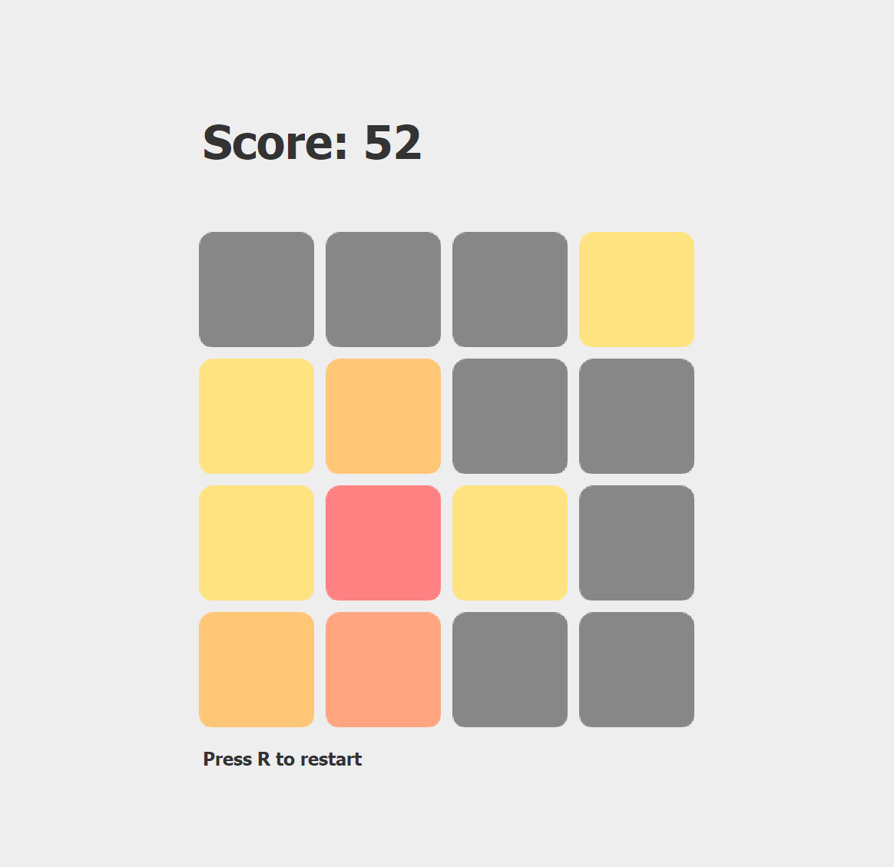

# Tile-Swapping Game

A remake of the HIT mobile game "2048", recreated in Java using the Swing library
- Use the arrow keys ⬆️⬅️⬇️➡️ to direct all the tiles up, left, down, or right!
- When two tiles hit each other, they will merge into a new tile worth DOUBLE the value...
- Keep merging until you get the coveted 2048 tile!

# Tools
- Java
- Java Swing
